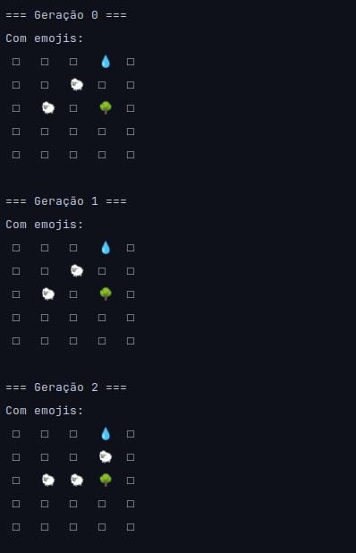

# 🧬 Conway's Game of Life – Java Implementation

A classic and visual implementation of **Conway's Game of Life**, built entirely in **Java**. This project explores the principles of cellular automata, simulating the evolution of a grid of cells based on simple rules that give rise to surprisingly complex behavior.

> *"The Game of Life is not a game in the traditional sense—there are no players, only rules. Yet it reveals how complexity can emerge from simplicity."*

---

## 📌 About the Project

**Conway's Game of Life** is a cellular automaton devised by mathematician John Horton Conway in 1970. Despite its name, it’s not a game—it’s a simulation where cells on a 2D grid are born, survive, or die based on the number of their living neighbors.

This project was developed as an exercise in logic, object-oriented programming, and understanding dynamic systems, using **Java** with a graphical user interface (Swing or JavaFX — *adjust based on your implementation*).

---

## 🎮 Rules of the Game

Each cell follows these rules every generation:

1. **Birth**: A dead cell with **exactly 3 live neighbors** becomes alive.
2. **Survival**: A live cell with **2 or 3 live neighbors** stays alive.
3. **Death by underpopulation**: A live cell with **fewer than 2 neighbors** dies.
4. **Death by overpopulation**: A live cell with **more than 3 neighbors** dies.

---

## 🛠️ Technologies Used

- **Language**: Java 11+
- **GUI Framework**: Swing (*or JavaFX, if applicable*)
- **Build Tool**: None (simple project) or Maven/Gradle (*if used*)
- **IDE**: IntelliJ IDEA / Eclipse / VS Code (*optional*)

---

## 🚀 How to Run

### Prerequisites
- JDK 11 or higher installed
- (Optional) Maven or Gradle, if used

### Steps

1. Clone this repository:
   ```bash
   git clone https://github.com/https://github.com/MayconVyctor/Game-Of-Life-Java
   git clone 
   cd Game-Of-Life-Java

2. Compile the project (example using javac)
   ```bash
    javac src/*.java -d out

3. Run the application:
     ```bash
   java -cp out Main

🖼️ Demo



📚 Key Learnings & Goals
Practice with core programming logic and algorithms
Understanding of emergent systems and cellular automata
Application of OOP concepts in Java (classes, encapsulation, etc.)
Integration of GUI with simulation logic
🤝 Contributions
Contributions are welcome! Feel free to open an issue or submit a pull request with improvements, new initial patterns, performance optimizations, or UI enhancements.

📄 License
This project is licensed under the MIT License. See the LICENSE file for details.

✨ Made by Maycon Vyctor
